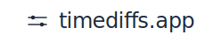
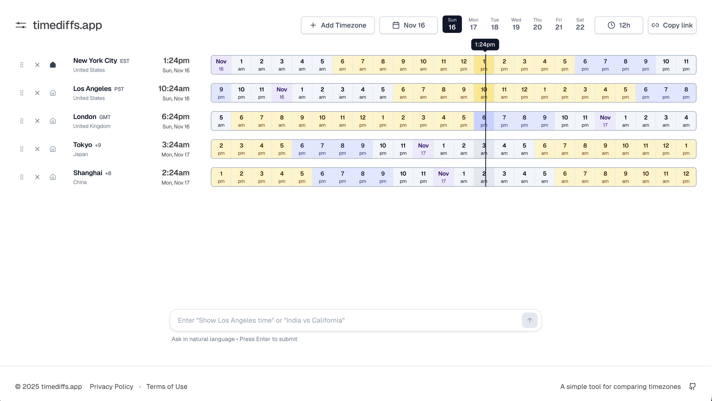

<div align="center">



**Timezone comparison tool with 24-hour timeline visualization**

[](https://opensource.org/licenses/MIT)
[](https://nextjs.org/)
[](https://www.typescriptlang.org/)
[](https://react.dev/)

[Visit App](https://timediffs.app) • [Report Bug](https://github.com/mochixlb/timediffs/issues) • [Request Feature](https://github.com/mochixlb/timediffs/issues)

</div>

---

## Screenshot



---

## Features

### Core Functionality

- **Natural Language Commands** - Commands like "New York timezone", "Compare Tokyo with London", or "Remove Paris"
- **24-Hour Timeline Visualization** - View all timezones side-by-side on an interactive timeline
- **Interactive Hover** - Hover over hours to see corresponding times across all timezones
- **Drag & Drop Reordering** - Reorganize timezones by dragging them

### User Experience

- **Home Timezone** - Set a reference timezone that stays highlighted
- **Date Picker** - View timezone comparisons for any date
- **Time Format Toggle** - Switch between 12-hour and 24-hour formats
- **Auto-Detection** - Detects your browser's timezone
- **URL State Management** - Share your timezone configuration via URL
- **Responsive Design** - Works on desktop, tablet, and mobile devices

---

## Quick Start

### Prerequisites

- Node.js 18+ and npm (or yarn/pnpm)

### Installation

```bash
# Clone the repository
git clone https://github.com/mochixlb/timediffs.git

# Navigate to the project directory
cd timediffs

# Install dependencies
npm install

# Start the development server
npm run dev
```

Open [http://localhost:3000](http://localhost:3000) in your browser to see the application.

---

## Tech Stack

### Core Framework

- **[Next.js 16](https://nextjs.org/)** - React framework with App Router
- **[React 19](https://react.dev/)** - UI library
- **[TypeScript](https://www.typescriptlang.org/)** - Type safety

### Styling & UI

- **[Tailwind CSS](https://tailwindcss.com/)** - Utility-first CSS framework
- **[Radix UI](https://www.radix-ui.com/)** - Accessible component primitives
- **[Framer Motion](https://www.framer.com/motion/)** - Animation library
- **[Lucide React](https://lucide.dev/)** - Icon library

### Key Libraries

- **[@vvo/tzdb](https://github.com/vvo/tzdb)** - Comprehensive timezone database
- **[date-fns](https://date-fns.org/)** & **[date-fns-tz](https://github.com/marnusw/date-fns-tz)** - Date manipulation and timezone handling
- **[@dnd-kit](https://dndkit.com/)** - Drag and drop functionality
- **[nuqs](https://nuqs.47ng.com/)** - URL state management
- **[Fuse.js](https://www.fusejs.io/)** - Fuzzy search for timezone selection
- **[cmdk](https://cmdk.paco.me/)** - Command menu component

---

## Building for Production

### Environment Variables

For production deployment, set the following environment variable:

```bash
NEXT_PUBLIC_SITE_URL=https://your-domain.com
```

**Important:** The URL must be a valid HTTPS URL without a trailing slash.

### Build Commands

```bash
# Create production build
npm run build

# Start production server
npm start
```

---

## Testing

```bash
# Run tests
npm test

# Run tests with UI
npm run test:ui

# Run tests once
npm run test:run

# Run tests with coverage
npm run test:coverage
```

---

## Usage Examples

### Natural Language Commands

The app supports natural language commands:

- `"New York timezone"` - Add New York timezone
- `"Compare Tokyo with London"` - Add both Tokyo and London
- `"Remove Paris"` - Remove Paris timezone
- `"Set home to UTC"` - Set UTC as home timezone

### Sharing Configurations

All timezone selections, date, and format preferences are stored in the URL. Simply copy and share the URL to let others see the same configuration.

---

## Project Structure

```
timediffs/
├── app/
│   ├── page.tsx
│   ├── layout.tsx
│   └── ...
├── components/
│   ├── timezone-comparison/
│   └── ui/
├── contexts/
│   └── timezone-context.tsx
├── hooks/
├── lib/
│   ├── timezone.ts
│   ├── timezone-data.ts
│   └── ...
└── types/
```

---

## Contributing

Contributions are welcome! Please feel free to submit a Pull Request.

1. Fork the repository
2. Create your feature branch (`git checkout -b feature/AmazingFeature`)
3. Commit your changes (`git commit -m 'Add some AmazingFeature'`)
4. Push to the branch (`git push origin feature/AmazingFeature`)
5. Open a Pull Request

---

## License

This project is licensed under the MIT License - see the [LICENSE](LICENSE) file for details.

---

## Acknowledgments

- Timezone data provided by [@vvo/tzdb](https://github.com/vvo/tzdb)
- Built with [Next.js](https://nextjs.org/) and [React](https://react.dev/)
